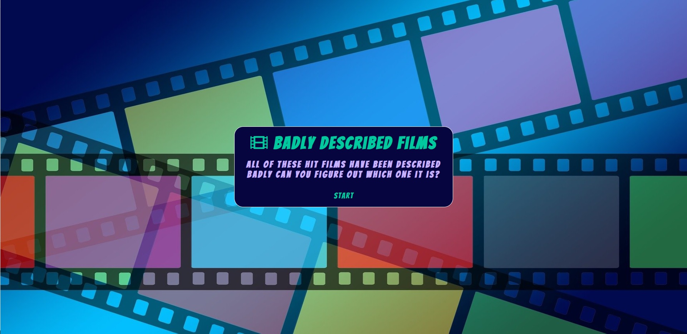
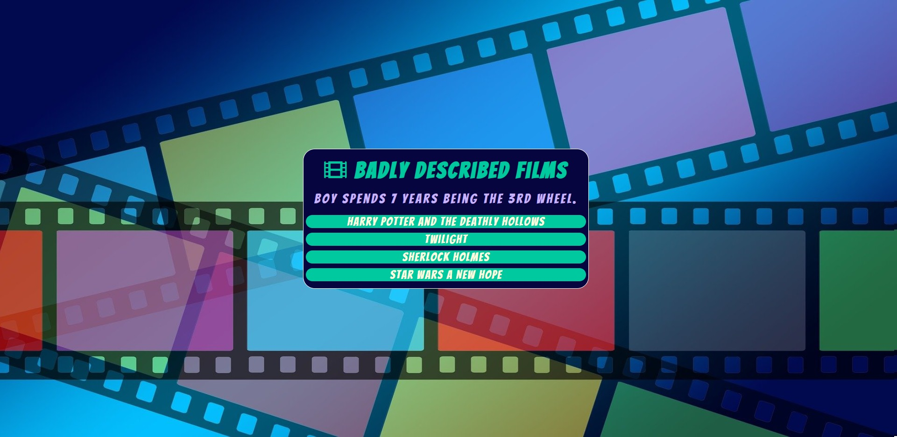
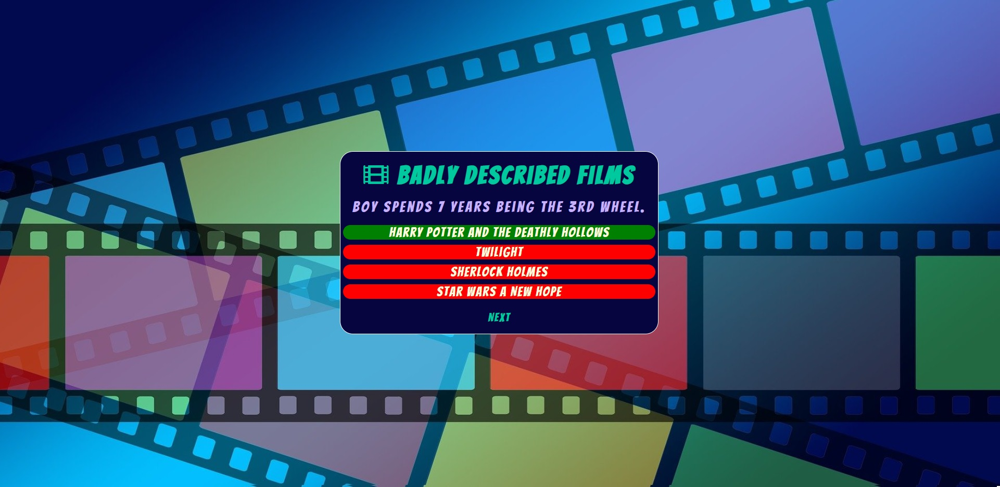
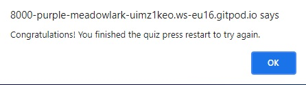
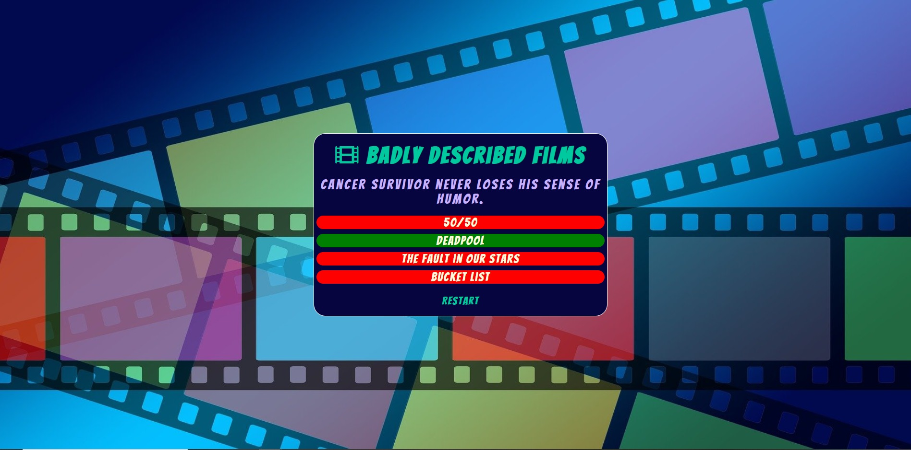
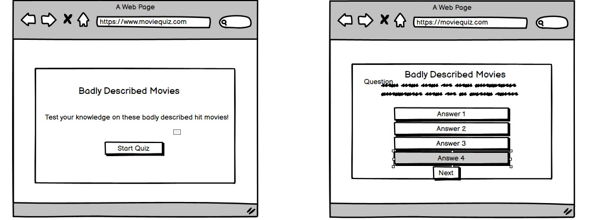

# Badly Described Films

[View published site on GitHub Pages](https://ak2489.github.io/badly-described-films/).

Image from [Am I Reponsive](http://ami.responsivedesign.is/).

## Project Overview

The Badly Described Film quiz is a website that aims to provide entertainment and a fun challenge to the user with a quiz game. It is a fun way to look at well established films and tests even the biggest film buffs knowledge. This site has been created as part of my Portfolio Project 2 for the Code institute.

## Features

### Start up

* Loading up the Quiz you can see a simple layout with a background image used from royalty free website [Pixabay](https://pixabay.com/). In the game area you can see the title using the font 'Bangers' from [GoogleFonts](https://fonts.google.com/?category=Display) and logo from [Fontawesome](https://fontawesome.com/). The tag line under the title gives the user a clue as to what the quiz is about and a start button. 

### Question Area

* After clicking start the first question loads up with 4 possible answers each one in their own button. The user can see this is now a multiple choice quiz and has an option of 4 answers to chose from. When the user hovers a mouse over the answers the background colour of the button changes. There are 10 questions in total they load up in a random order every time the quiz is started.

### Answer Area

* Upon selecting an answer the background colour of the buttons changes to show the user the right and wrong answers. Right being shown by green and wrong being shown by red. It also loads up a next button to go to the next question. 

### End of Quiz

* After the 10 questions have cycled through a propmt comes up to say you have finished the quiz and instructs the user to click restart to try again. 

### Additional Features

* The colour scheme was chosen from [MyColorSpace](https://mycolor.space/) and was picked based on the dark navy colour used in the background image. 

### Features Left to Implment

* I would have like to have implemented a score counter to the game so the user can see how they are doing. 

## Testing 
### Validator Testing 
* HTML - No errors were returned when passing through the official [W3C validator](https://validator.w3.org/nu/#textarea).
* CSS - No errors were found when passing through the official [(Jigsaw) validator](https://jigsaw.w3.org/css-validator/validator).
* JavaScript - No errors were found when passing through the official [Jshint validator](https://jshint.com/).
    - The following metrics were returned:
    - There are 11 functions in this file.
    - Function with the largest signature take 2 arguments, while the median is 1.
    - Largest function has 8 statements in it, while the median is 2.
    - The most complex function has a cyclomatic complexity value of 2 while the median is 1.

### Unfixed Bugs

* There are no unfixed bugs in this project.

## Deployment

* The site was deployed to GitHub pages. The steps to deploy are as follows:
    * In the GitHub repository, navigate to the Settings tab
    * From the source section drop-down menu, select the Master Branch
    *Once the master branch has been selected, the page will be automatically refreshed with a detailed ribbon display to indicate the successful deployment.

The live link can be found here - https://ak2489.github.io/badly-described-films/

## Credits

### Content 

* To help with the JavaScript element of the quiz i used this [YouTube](https://www.youtube.com/watch?v=f4fB9Xg2JEY&t=2111s) video and CI [love Maths](https://github.com/Code-Institute-Solutions/love-maths-2.0-sourcecode/tree/master/05-tidying-up/01-a-few-last-things) as a reference.
* To help with the CSS element i used [w3schools](www.w3schools.com).
* The icons in the Title was taken from [Font Awesome](https://fontawesome.com/).
* Use of Balsamiq Wireframes to help draw the layout of the game. 

### Media 

* Background image used from royalty free website [Pixabay](https://pixabay.com/).

### Thank You

* I would like to thank Jo and John on the Tutor assistance for their support through this project.
* I would also like to thank Chris McGonigle and Stephen Darcy for their assitance and feedback on the peer to peer reviews on Slack. 

